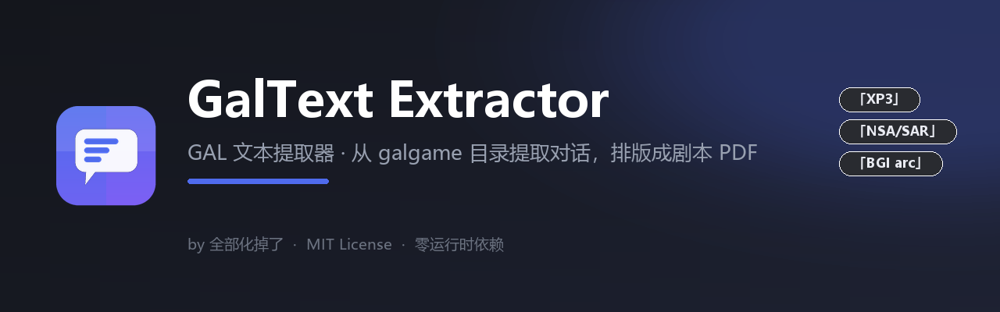
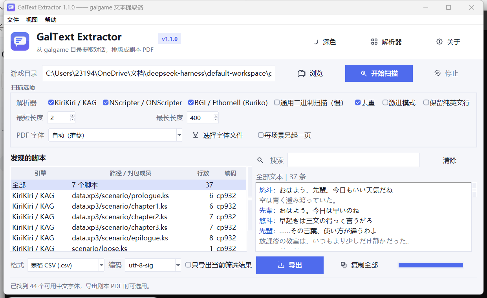
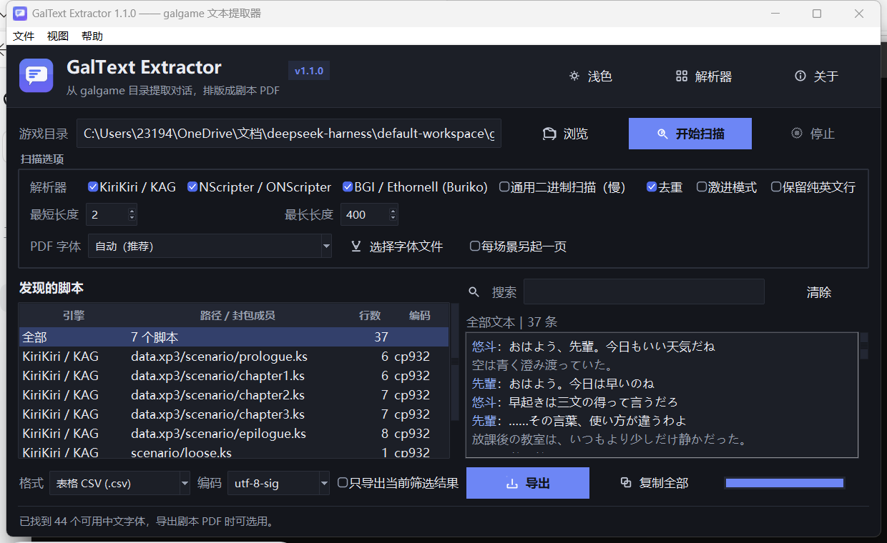
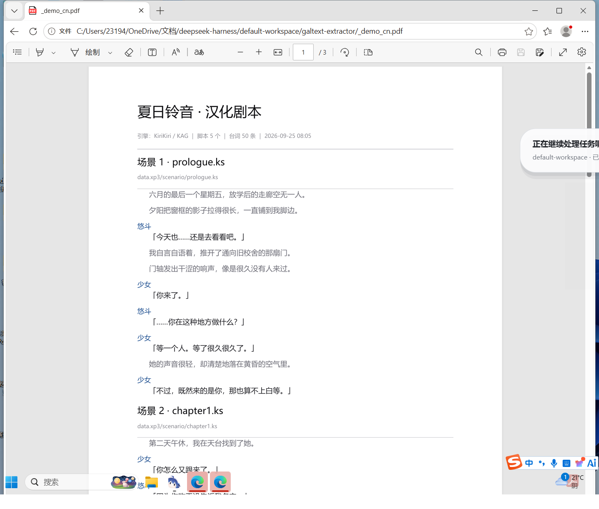

# GalText Extractor · GAL 文本提取器

**从 galgame 安装目录里把对话文本挖出来，再排成一份能通读、能打印、能搜索的剧本 PDF。**

[](LICENSE)
[](pyproject.toml)
[](pyproject.toml)
[](#安装)
[](https://github.com/Huadiaole/galtext-extractor/actions/workflows/ci.yml)
[](CHANGELOG.md)

纯 Python 标准库实现（`tkinter` / `zlib` / `struct` / `re`），
**零运行时依赖、离线可用、不注入进程、不修改游戏文件、不联网**。

<table>
<tr>
<td width="50%"><br><div align="center">浅色模式</div></td>
<td width="50%"><br><div align="center">深色模式</div></td>
</tr>
</table>

---

## 目录

- [它解决什么问题](#它解决什么问题)
- [安装](#安装)
- [快速开始](#快速开始)
- [支持的引擎](#支持的引擎)
- [剧本 PDF 导出](#剧本-pdf-导出)
- [界面说明](#界面说明)
- [命令行参考](#命令行参考)
- [导出格式](#导出格式)
- [汉化工作流](#汉化工作流)
- [常见问题](#常见问题)
- [项目结构](#项目结构)
- [开发](#开发)
- [打包成 exe](#打包成-exe)
- [已知限制](#已知限制)
- [贡献](#贡献)
- [许可与作者](#许可与作者)

---

## 它解决什么问题

想读一份 galgame 的完整剧本、想翻译、想做文本分析，但游戏文本锁在
XP3 / NSA / arc 这些封包里，还常常是 Shift-JIS 加各种 XOR 混淆。

这个工具做三件事：

1. **解析** —— 识别引擎，解开封包，还原脚本，自动判定编码；
2. **整理** —— 剥离标签、拆分说话人、滤掉代码行、全局去重；
3. **产出** —— 导出 TXT / CSV / JSON / 翻译模板，或者直接排成**剧本风格的 PDF**。

> 本工具只**读取**游戏文件，不修改、不注入、不联网。

---

## 安装

### 方式一：直接运行（推荐）

需要 Python 3.10 或更高版本（开发环境为 3.14）。**不需要 pip install 任何东西**。

```bash
git clone https://github.com/Huadiaole/galtext-extractor.git
cd galtext-extractor
python -m galtext gui
```

Windows 上也可以直接双击 `run_gui.bat`。

### 方式二：pip 安装

```bash
pip install galtext-extractor           # 零依赖
pip install "galtext-extractor[modern]" # 额外装 sv-ttk，界面变成 Fluent 风格
galtext gui
```

### 方式三：单文件 exe

```bash
build_exe.bat        # 需要联网装 PyInstaller，产物在 dist/GalTextExtractor.exe
```

---

## 快速开始

### 先生成一份示例游戏试试手

手头没有方便测试的游戏时，可以造一个**合成**的示例目录（不含任何真实游戏数据）：

```bash
python make_sample.py
python -m galtext gui sample_game\SampleGame
```

它会生成按规范逐字节构造的 `data.xp3`（5 个脚本，明文与 zlib 压缩混排）、
XOR 加密的 `nscript.dat`、一个散装 `.ks`，以及一个随机噪声文件用来验证抗干扰能力。

> 仓库里已经预生成好了一份 `sample_game\`，可以直接跳过这一步。

### 正式使用

```bash
# 图形界面：选目录 → 开始扫描 → 看预览 → 导出
python -m galtext gui "D:\Games\SomeGame"

# 命令行：直接导出
python -m galtext scan "D:\Games\SomeGame" -o out.csv -f csv

# 导出剧本 PDF
python -m galtext scan "D:\Games\SomeGame" -f pdf -o script.pdf

# 看这台机器上有哪些中文字体可用
python -m galtext scan --pdf-list-fonts

# 认不出引擎？开兜底扫描 + 激进模式
python -m galtext scan "D:\Games\SomeGame" -o out.txt --include-generic --aggressive
```

**目录要选对**：是游戏**根目录**（有 `data.xp3` / `nscript.dat` / `*.exe` 的那一层），
不是 `scenario` 子目录。

---

## 支持的引擎

| 解析器 | 关键字 | 识别依据 | 封包 | 脚本 | 加密 / 压缩 |
| --- | --- | --- | --- | --- | --- |
| KiriKiri / KAG | `kirikiri` | `*.xp3`、`*.ks` | XP3（索引可 zlib 压缩；成员可 zlib 压缩） | `.ks` / `.tjs`，散装脚本 | 官方 XP3 hash-XOR 过滤器；未知的第三方过滤器**跳过并记录**，不瞎猜 |
| NScripter / ONScripter | `nscripter` | `nscript.dat`、`*.nsa`、`*.sar` | NSA / SAR | `nscript.dat`(XOR `0x84`)、`00.txt`、NSA 内成员 | XOR `0x84`；成员 **LZSS** 解压（Okumura 变体） |
| BGI / Ethornell | `bgi` | `PackFile` / `BURIKO ARC20` 开头的 `.arc` | BGI arc v1 / v2 | `.ws2` / `.dsc` / 文本成员 + 字符串扫描 | **DSC** 的 key 流 + Huffman 解压 |
| 散装脚本 | `plaintext` | 目录里散放的 `.ks` / `.txt` / `.ws2` 等 | — | 直接按编码解码 | — |
| 通用二进制扫描 | `generic` | 永远不作为「识别结果」 | — | 在任意二进制里扫文本串 | — |

几个设计取舍：

- **识别不出引擎不会放弃** —— 所有专业解析器都一无所获时，自动退化为通用二进制扫描。
- **散装脚本按扩展名路由** —— 目录里的 `scenario/foo.ks` 虽然由 `plaintext` 发现，
  但会交给 `kirikiri` 解析 KAG 语法，而不是当纯文本硬啃。
- **不谎报能力** —— 读不懂的格式明确标注「不支持」并跳过，而不是输出乱码冒充结果。

### 关于 RealLive

`reallive` 在注册表里**预留了位置但没有实现**：

```console
$ python -m galtext engines
GalText Extractor 1.1.0  ·  全部化掉了  ·  MIT

关键字         名称                              状态
------------------------------------------------------------
kirikiri    KiriKiri / KAG                  可用
nscripter   NScripter / ONScripter          可用
bgi         BGI / Ethornell (Buriko)        可用
plaintext   散装脚本文件                      可用
generic    通用二进制扫描                     可用
reallive    reallive                        不可用（No module named 'galtext.parsers.reallive'）
```

这是有意为之的**优雅降级**：缺少该模块时 `engines` 会把它排在最后并如实标注「不可用」，
界面不显示对应勾选项，其它引擎完全不受影响。想补上它，
按[解析器契约](#新增一个引擎解析器)放一个 `galtext/parsers/reallive.py` 即可 ——
模块一旦出现在 `parsers/` 目录里就会自动被发现，无需登记。

---

## 剧本 PDF 导出

把提取出来的台词排成一份**能通读、能打印、能搜索**的剧本：



| 元素 | 样式 |
| --- | --- |
| 标题块 | 目录名（或 `--pdf-title`）+ 引擎 / 脚本数 / 台词数 / 生成时间 |
| 场景标题 | `场景 N · 脚本文件名`，下方小灰字标出封包内路径 |
| 角色名 | 蓝色，独立一行 |
| 台词 | 缩进 1.6 em，深色 |
| 旁白 | 缩进同上，**灰色**（与台词区分） |
| 页码 | 每页底部居中 `— N / 总数 —` |

折行遵守中文排版禁则：`。，、！？` 不会跑到行首，`（「『` 不会留在行尾，
连续英文单词不会从中间截断，角色名不会被单独留在页尾。

### 用法

```bash
# 自动挑一个系统中文字体
python -m galtext scan "D:\Game" -f pdf -o script.pdf

# 指定字体 / 每场景另起一页 / 自定义标题
python -m galtext scan "D:\Game" -f pdf -o script.pdf \
    --pdf-font C:\Windows\Fonts\simhei.ttf \
    --pdf-title "某游戏 汉化剧本" --pdf-scene-per-page
```

界面上：底部「格式」选「剧本 PDF (.pdf)」，选项区可以下拉选字体或点「选择字体文件」。

### 字体是怎么嵌进去的

PDF 不像 HTML 能靠系统字体渲染 —— 字体必须**嵌进文件**，否则换台机器就是一片方框。
中文字体动辄十几 MB，直接嵌会让 PDF 大得没法看，所以这里做了**字形子集化**：
先统计整份剧本实际用到哪些字，只把这些字形（以及复合字形引用到的组件）打进 PDF。

实测：

| 字体 | 原始大小 | 50 条台词 | 400 条台词 |
| --- | --- | --- | --- |
| SimHei（黑体） | 9.29 MB | **35 KB** | ~60 KB |
| Microsoft YaHei UI（微软雅黑） | 18.79 MB | **217 KB** | ~300 KB |

子集里有一块固定开销：`cmap` 字符映射表是原样保留的（约 180 KB），
因为字形 ID 必须保持不变，复合字形的引用才不会错位。
所以 PDF 大小主要取决于**选了哪个字体**，而不是台词多少。想文件小就选 SimHei。

字体挑选顺序：`msyh.ttc` → `simhei.ttf` → `Deng.ttf` → `simsun.ttc` → `msjh.ttc` …
找不到中文字体会明确报错，并提示用 `--pdf-font` 指定。

### 实现说明

三个零依赖模块：

- [`fontkit.py`](galtext/fontkit.py) —— TrueType/TTC 解析与字形子集化。
  关键取舍是**不重排字形 ID**：只把用不到的字形改成空字形并重建 `loca`，
  这样复合字形的组件引用天然保持有效，避开了重编号带来的整类 bug。
- [`pdfgen.py`](galtext/pdfgen.py) —— 最小 PDF 写入器。
  Type0 + CIDFontType2 + Identity-H 字体嵌入，带 `/ToUnicode` CMap
  （**所以 PDF 里的中文可以复制、可以 `Ctrl+F` 搜索**），内容流与字体流都走 FlateDecode。
- [`scriptpdf.py`](galtext/scriptpdf.py) —— 剧本排版：场景分组、样式、折行、分页。

---

## 界面说明

顶部是品牌栏（版本号、深浅色切换、解析器列表、关于），下面是目录选择与主操作。

| 区域 | 说明 |
| --- | --- |
| **游戏目录** | 输入框支持直接粘贴路径，回车即开始扫描 |
| **开始扫描 / 停止** | 扫描在后台线程跑，随时可中断；进度条与状态栏实时更新 |
| **扫描选项** | 解析器勾选、通用扫描、去重、激进模式、最短/最长长度、**只保留中文行**、**封包覆盖**、PDF 字体 |
| **发现的脚本** | 左栏列出每个脚本：引擎、封包内路径、行数、判定到的编码；有问题的会标 ⚠ 与原因 |
| **文本预览** | 右栏显示当前范围（全部 / 单个脚本）的台词，**角色名蓝色、旁白灰色** |
| **搜索** | 输入即筛选，命中部分高亮；「只导出当前筛选结果」可只导出筛出来的部分 |
| **导出** | 六种文本格式 + 剧本 PDF，编码可选 |

**深色模式**：点品牌栏的「深色 / 浅色」按钮，或用「视图」菜单。
界面用 `sv-ttk`（若已安装）呈现 Fluent 风格，否则用内置的自绘主题，两者都支持明暗切换。

> 上面的截图用的是**内置自绘主题** —— 也就是 clone 下来不装任何东西、或直接用打包 exe 时的默认观感。
> 装了 `sv-ttk` 会换成 Fluent 风格，布局与功能一致，只是控件观感不同。

> 状态栏那句「已找到 N 个可用中文字体」是后台扫描字体目录的结果，不阻塞启动。

---

## 命令行参考

```console
$ python -m galtext --help
$ python -m galtext engines              # 列出解析器
$ python -m galtext scan <目录> [选项]     # 扫描并导出
$ python -m galtext gui [目录]            # 打开界面
```

`scan` 的常用选项：

| 选项 | 默认 | 说明 |
| --- | --- | --- |
| `-o, --output` | 按目录名生成 | 输出路径 |
| `-f, --format` | `txt` | `txt` / `csv` / `tsv` / `json` / `jsonl` / `template` / `pdf` |
| `-e, --encoding` | `utf-8-sig` | 输出编码：`utf-8-sig` / `utf-8` / `utf-16` / `cp932` / `cp936` / `cp950` |
| `--force-encoding` | `auto` | 强制按指定编码解读脚本（自动判定失败时用） |
| `--engines` | 自动 | 只使用指定解析器，逗号分隔 |
| `--include-generic` | 关 | 启用通用二进制扫描（慢） |
| `--aggressive` | 关 | 放宽代码行过滤，宁可多收 |
| `--no-dedupe` | — | 不去重 |
| `--min-len` / `--max-len` | `2` / `400` | 文本长度区间 |
| `--keep-ascii` | 关 | 保留纯 ASCII 行 |
| `--allow-no-japanese` | 关 | 不要求文本含日文/汉字 |
| `--chinese-only` | 关 | 只保留中文行（丢掉含假名的日文行） |
| `--keep-all-versions` | 关 | 关闭封包覆盖：同名脚本在多个封包里各有一份时全部保留 |
| `--pdf-title` / `--pdf-font` / `--pdf-font-index` | — | 剧本 PDF 的标题与字体 |
| `--pdf-scene-per-page` / `--pdf-flat` / `--pdf-no-source` | 关 | 剧本 PDF 的分页与场景标题控制 |
| `--pdf-list-fonts` | — | 列出可用中文字体后退出 |
| `--quiet` | 关 | 只输出结果路径 |

---

## 导出格式

| 格式 | 扩展名 | 内容 |
| --- | --- | --- |
| `txt` | `.txt` | 一行一句，`说话人：台词`（可选不带说话人） |
| `csv` | `.csv` | 序号 / 说话人 / 文本 / 来源 / 引擎 |
| `tsv` | `.tsv` | 同上，制表符分隔 |
| `json` | `.json` | 完整结构：引擎打分、脚本清单、全部文本 |
| `jsonl` | `.jsonl` | 一行一个 JSON 对象，方便流式处理 |
| `template` | `.csv` | **翻译模板**：`原文` 填好，`译文` 留空 |
| `pdf` | `.pdf` | **剧本 PDF**：场景标题 + 角色名 + 台词 + 旁白，带页码 |

输出编码可选：`utf-8-sig`（默认，Excel / 记事本友好）、`utf-8`、`utf-16`、
`cp932`（日文工具）、`cp936`（简中工具）、`cp950`（繁中工具）。
PDF 不存在编码问题（自带字体与 Unicode 映射）。

---

## 汉化工作流

| 方向 | 做法 | 适用场景 |
| --- | --- | --- |
| **从已汉化的版本提取** | 把工具指向汉化版目录（或打过汉化补丁的目录），提取出来就是中文 | **最省事**：不需要翻译步骤，也不联网 |
| **翻译模板** | `-f template` 导出 `原文/译文` 表 → 填完译文 → 排版时读回 | 需要自己翻译或找人校对 |
| **翻译后排版** | `-f pdf` 直接排成中文剧本 | 想要一份能通读或打印的成品 |

推荐流程：先用 `-f template` 导出表格（这也是校对时最方便的形态），
再用 `-f pdf` 得到成品剧本。先开着「去重」能省掉相当一部分重复劳动。

### 原版和汉化补丁同时存在时

很多汉化补丁是**叠加**在原版上的，典型布局是 `data.xp3`（日文原版）
+ `patch.xp3`（汉化补丁），两者装着**同名**脚本。引擎按文件名顺序加载、
后者覆盖前者，本工具遵循同样的语义：

- **默认「封包覆盖」开启** —— 同名脚本只保留优先级最高的那份，也就是汉化补丁，
  输出直接是中文，不会混进原文；
- **被覆盖的不会悄悄消失** —— 会以「被 ××× 覆盖，已跳过」的形式列在
  「发现的脚本」里，并给出一条汇总提示。你能看到跳过了什么、为什么；
- **优先级**：散装文件 > 封包；封包之间按文件名顺序，**靠后的覆盖靠前的**
  （所以 `patch.xp3` 盖掉 `data.xp3`，`scenario/*.ks` 盖掉封包里的同名文件）。

想同时拿到原文和译文做对照，关掉「封包覆盖」（CLI 加 `--keep-all-versions`）。

### 实在分不开时：只保留中文行

如果补丁形式特殊、覆盖语义没起作用，结果里原文和译文混在一起，
可以打开**「只保留中文行」**（CLI 加 `--chinese-only`）：按
「日文行必定含假名、中文行基本不含」这一点把原文滤掉。

这是**启发式**而不是语言识别，代价是中文里残留的假名（拟声词、日式称呼）
会一起被丢掉。它是个保险开关，不是首选方案 —— 首选是上面的封包覆盖。

---

## 常见问题

**Q：扫出来 0 条文本怎么办？**

按顺序试：① 确认选的是游戏**根目录**；② 勾上「通用二进制扫描」；③ 勾上「激进模式」；
④ 把「最短长度」调成 1；⑤ 用 `python -m galtext engines` 确认解析器都可用。

**Q：文本是乱码（一片 `ｱｲｳ` 半角片假名或问号）？**

编码判错了。用命令行强制指定：

```bash
python -m galtext scan "D:\Game" --force-encoding cp932 -o out.txt
```

**Q：同一句话在多个脚本里出现，只保留了一条？**

这是「去重」的预期行为。想保留全部就取消勾选（或加 `--no-dedupe`）。

**Q：`nscript.dat` 这类文件的编码列显示得怪怪的？**

那些文件是先 XOR 再解码的，编码列显示的是**解开之后**的实际编码，
所以看到 `cp932` 是对的。

**Q：导出 PDF 时报「字体缺少 N 个字符」？**

那个汉化版用了生僻字或自定义字符。换一个字体（宋体 / 雅黑 / 黑体互替）通常就解决了。
缺字会被如实报告而不会画成方框。

**Q：能不能 OCR 图片文字，或者钩取运行中的游戏？**

不能。这一版只做**静默的脚本/封包解析**：不注入进程、不截图、不联网。
对有反调试保护或文本全在加密资源里的游戏，这套方法无效。

**Q：深色模式下菜单栏还是白的？**

Windows 上 `tk.Menu` 生成的菜单栏由系统绘制，应用无法改色 —— 这是 Tk 的平台限制，
不是主题没生效。窗口主体、表格、输入框都是跟着主题走的。

---

## 项目结构

```
galtext-extractor/
├── galtext/
│   ├── __init__.py         版本 / 作者 / 许可
│   ├── __main__.py         python -m galtext 入口
│   ├── common.py           公共数据类型
│   ├── textkit.py          编码探测、文本清洗、说话人拆分、二进制串扫描
│   ├── pipeline.py         扫描调度：探测 → 发现 → 抽取
│   ├── exporter.py         导出格式（含 PDF 统一入口）
│   ├── fontkit.py          TrueType/TTC 解析 + 字形子集化
│   ├── pdfgen.py           最小 PDF 写入器
│   ├── scriptpdf.py        剧本排版引擎
│   ├── theme.py            配色 / ttk 样式 / 图标（明暗双主题）
│   ├── cli.py              命令行界面
│   ├── gui.py              Tkinter 图形界面
│   ├── assets/             图标（构建期由 scripts/make_assets.py 生成）
│   └── parsers/            各引擎解析器 + 注册表
├── tests/                  110 个测试，全部使用合成样本
├── scripts/make_assets.py  重新生成图标与配图（需要 Pillow）
├── docs/                   截图、横幅、示例 PDF
├── make_sample.py          生成示例游戏目录
├── run_tests.py            跑全部测试
└── .github/                CI 与 issue / PR 模板
```

---

## 开发

```bash
git clone https://github.com/Huadiaole/galtext-extractor.git
cd galtext-extractor
python -m venv .venv
.venv\Scripts\activate
pip install -e ".[dev]"
python run_tests.py
```

测试**不依赖任何真实游戏**：`tests/fixtures.py` 会按各引擎的格式规范
**逐字节现造** XP3 / NSA / SAR 等样本，所以测试既能在 CI 上跑，
同时也是解析器的真实性验证 —— 而不是「文件存在就算过」。

各解析器模块还带独立自测（会真的造样本并断言往返一致）：

```bash
python -m galtext.parsers.kirikiri
python -m galtext.parsers.nscripter
python -m galtext.parsers.bgi
python -m galtext.fontkit          # 字形子集化，会真的读写字体文件
```

重新生成图标（改了配色或想换造型时）：

```bash
python scripts/make_assets.py
python scripts/make_assets.py --check
```

代码规范、提交信息格式、PR 流程见 [CONTRIBUTING.md](CONTRIBUTING.md)。

### 新增一个引擎解析器

在 `galtext/parsers/` 下放一个模块即可，注册表会自动发现它：

```python
ENGINE_ID = "myengine"
ENGINE_NAME = "My Engine"

def detect_dir(root) -> int:              # 0-100 置信度
    ...

def iter_scripts(root):                   # 产出 (虚拟路径, 字节)
    ...

def extract_lines(vpath, data) -> list:   # 产出候选文本行
    ...
```

可选再实现 `guess_encoding(vpath, data) -> str`，让界面上的编码列显示更准。
**不需要修改任何其它文件。**

---

## 打包成 exe

```bash
build_exe.bat
```

会在项目下建一个 `.venv-build` 虚拟环境装 PyInstaller，产物为
`dist\GalTextExtractor.exe`（单文件、免安装）。
仓库的 CI 里也有一个**手动触发**的打包任务，见 `.github/workflows/ci.yml`。

---

## 已知限制

- **只处理静态脚本** —— 对文本全在加密资源里、或运行时动态拼装文本的游戏无效。
- **通用扫描的边界噪声** —— 兜底扫描按字节流切串，串首/串尾偶尔会粘上一个乱码字。
- **韩文不做自动识别** —— CP949 与 GBK 的双字节空间几乎完全重叠，靠统计无法可靠区分，
  强行猜会把简中文本判成韩文。需要时用 `--force-encoding cp949` 显式指定。
- **同名文件不区分** —— 不同封包里同名成员会各自保留（虚拟路径带封包前缀），
  但全局去重可能把同名脚本里的相同台词合并。
- **不支持的加密就跳过** —— 不会输出乱码冒充结果，会在「发现的脚本」列表里标出原因。
- **剧本 PDF 使用 TrueType 字体** —— `.otf`（CFF 轮廓）不支持子集化，会明确报错。
  中文字体基本都有 TrueType 版本，影响很小。
- **PDF 里的 `cmap` 是固定开销** —— 约 180 KB（为了保持字形 ID 不变），
  所以文件大小主要取决于选了哪个字体。想要小文件就选 SimHei。
- **剧本 PDF 是纯中文单栏** —— 不做中日对照、不做表格排版；要那种形态请用 CSV / 翻译模板。
- **Windows 菜单栏不跟随深色主题** —— Tk 的原生菜单栏由系统绘制，应用无法改色。

---

## 贡献

欢迎提交 issue 与 PR。开始之前请读一下 [CONTRIBUTING.md](CONTRIBUTING.md)，
里面有开发环境、测试要求与提交信息规范。

**不接受的 issue**：求游戏资源、求汉化补丁、求绕过反调试。
这个工具只做格式解析，不涉及任何游戏内容的传播。

安全问题请按 [SECURITY.md](SECURITY.md) 私下报告。

---

## 许可与作者

**作者：[全部化掉了](https://github.com/Huadiaole)**

以 [MIT License](LICENSE) 发布 —— 可以自由使用、修改、分发，保留版权声明即可。

### 致谢

解析器的字节级格式细节参考了这些开源项目的工作：

- [GARbro](https://github.com/morkt/GARbro)（morkt，MIT）—— NSA/SAR 与 XP3 格式
- [arc_unpacker](https://github.com/vn-tools/arc_unpacker) —— BGI arc 与 DSC 格式
- [KiriKiri2 / TVP](https://github.com/krkrz/krkr2) —— XP3 容器规范
- [ONScripter](https://github.com/ogapee/onscripter) —— LZSS 解压例程

### 免责声明

本工具仅供**个人学习、研究与翻译**使用。请在自己合法拥有的游戏副本上使用，
不要传播提取出的原始资源，也不要用于任何商业用途。
**游戏文本版权归原厂商所有。**
